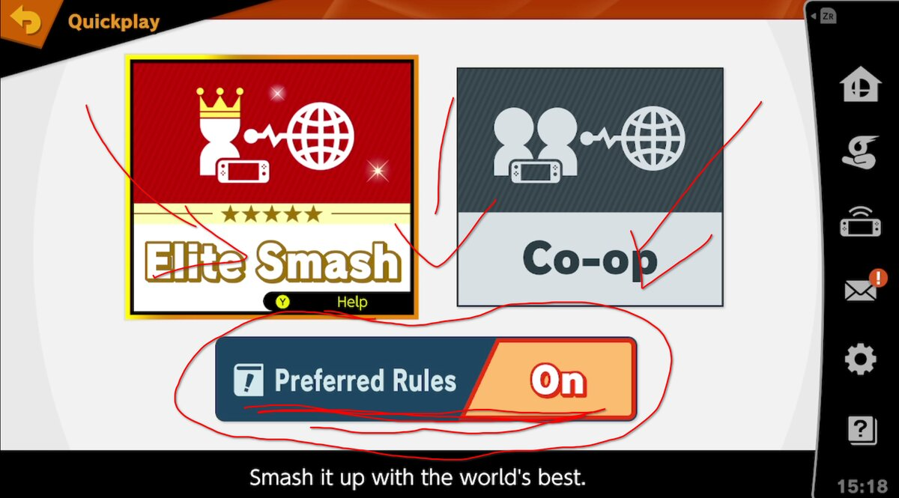
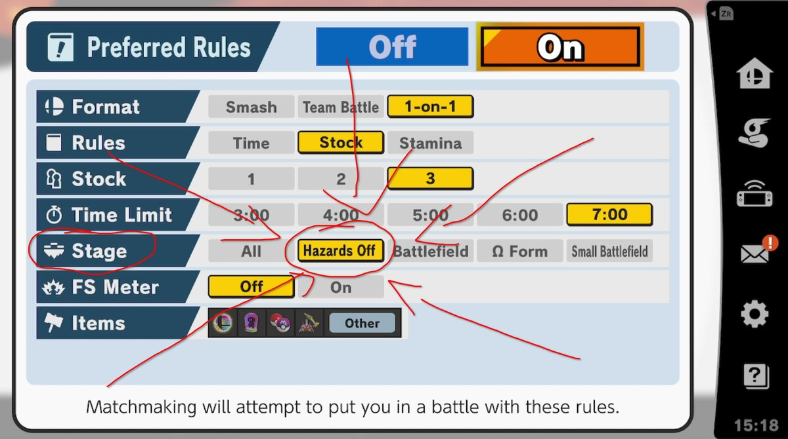
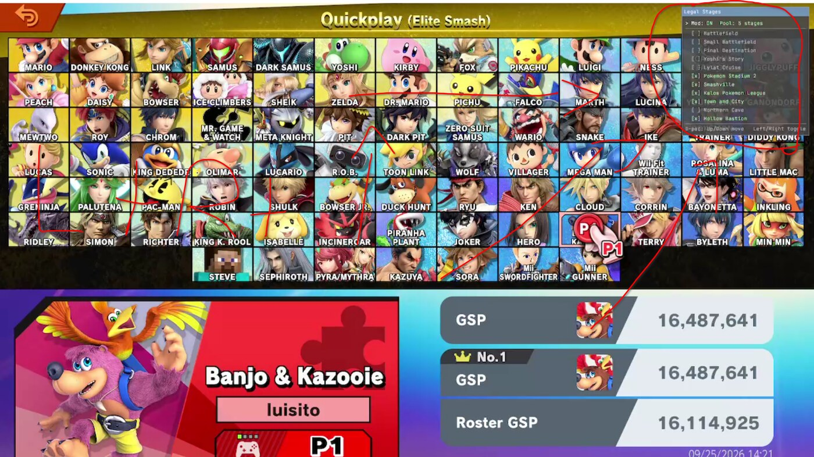
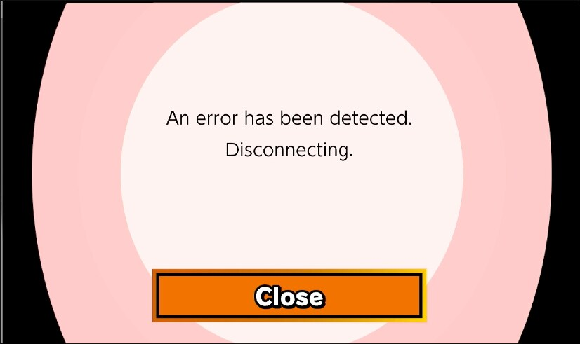

## [Download zip with both plugins](https://github.com/luisitossb/elite-legal-stages-public/releases/latest/download/elite-legal-stages-public.zip)
## TLDR: Hold down BOTH SHOULDER buttons then press UP on the DPAD to bring up the menu --> Enable / Disable stages at will!!!!!!
## Install tutorial

- Drag the contents of the zip into the root of your SD card
- OR, you can just drag the 2 .NRO files directly into your plugins folder

## Dependency

- I included the imgui_smash.nro file, it's REQUIRED!

## In-game

- Go to Online → Preferred Rules → Enable Stage: HAZARDS OFF

- Hold down BOTH shoulder buttons then press up on the D-PAD to bring up the menu
- Enable / Disable mod / stages at will

## Features

- Saves your ruleset → On reboot your settings stay the same
- All stages are still available and compatible with all music on all stages mods
- No restarts needed to toggle plugin or available stages

## Notes

- This plugin will not disable your stages, so in arenas, offline, or other things, you'll still have access to select any stage!
- I've tested this mod for a grand total of 2 days, and haven't had a single crash / issue.
- This version of the mod won't overwrite your opponents ruleset / stage like the first version I made. 
- I'm not a smart person, this was not that hard to do, I'm sure other people have done something similar for the latest patch.
- Don't reverse engineer my work to ruin elite smash! Thanks!
- Other mod (https://gamebanana.com/mods/510559) doesn't work anymore as far as I'm aware, the method for shrinking your stage list causes / this error:

## Credits

- Here's someone who is actually super smart and talented: [Coolsonickirby](https://github.com/Coolsonickirby) made [imgui-smash](https://github.com/Coolsonickirby/imgui-smash), the plugin this mod relies on for its in-game menu. This has easily been one of my favorite plugins and he makes a lot of other awesome work in the modding scene!!!!
